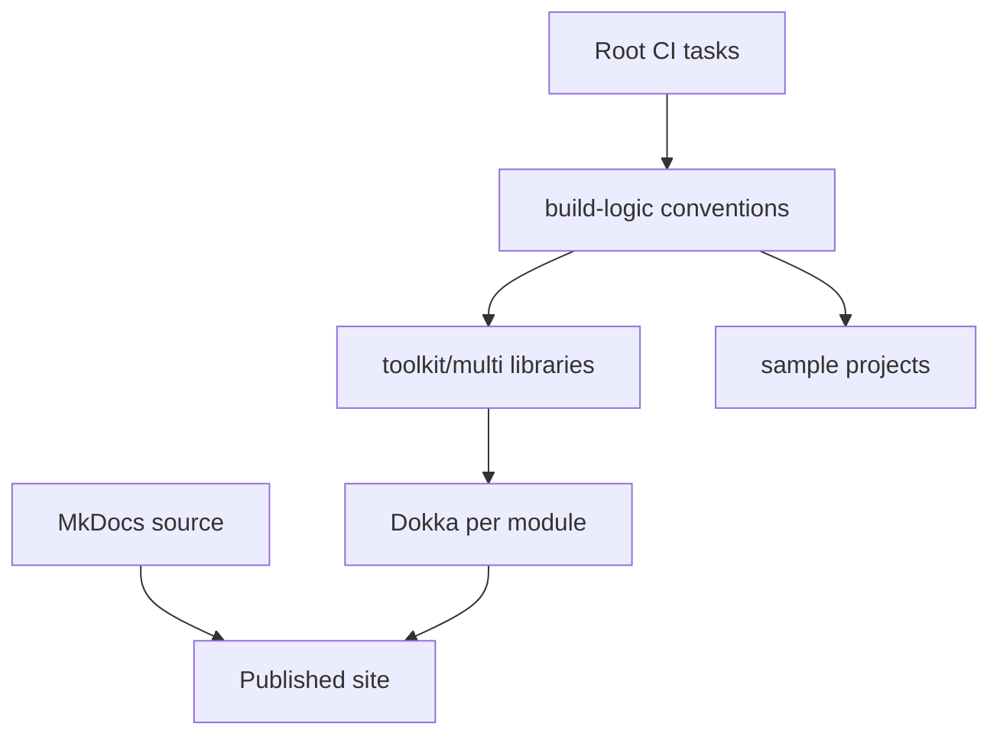

# Repository Architecture

## Layout

| Path | Responsibility |
|:-----|:---------------|
| `toolkit/multi` | Published Kotlin Multiplatform libraries |
| `sample/shared` | Shared sample application and features |
| `sample/target` | Android, desktop, and web entry points |
| `build-logic` | Convention plugins and publication configuration |
| `docs` | MkDocs source and generated Dokka location |
| `.github` | CI, release, and publication automation |

## Source Sets

Library convention plugins configure Android, JVM, JS browser, WasmJS browser,
iOS arm64, and iOS simulator arm64. Modules add intermediate source sets when
several platforms share an implementation, such as the operational and stub
variants in `storage-datastore`.

## Build Logic

Keep target, lint, test, publishing, and documentation conventions in
`build-logic`. Module build files should declare module-specific dependencies
and source-set behavior, not duplicate repository policy.

## Samples

Sample projects are included only when `-PincludeSamples=true` or Android
Studio injects its IDE property. This keeps library CI independent from the
larger sample dependency graph.
