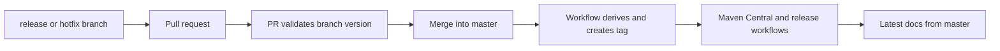

# Publishing and Releases

## Local Publication

```bash
./gradlew ciPublishLocal
```

Use this to inspect locally published metadata and consume a candidate from a
separate project.

## Release Branches

Accepted branch names:

- `release/X.Y.Z`
- `release/X.Y.Z-rcNN`
- `hotfix/X.Y.Z`
- `hotfix/X.Y.Z-rcNN`

The version segment must be a valid semantic version and RC suffixes use two
digits.

## Release Preparation

1. Run the `project-docs` skill in Audit mode.
2. Review the factual report and approve required KDoc changes.
3. Run Sync mode and all documentation validation.
4. Run `ciLint`, `ciBuild`, `ciTest`, and `ciCoverage`.
5. Validate samples separately and record known external blockers.
6. Confirm every Git tag has a changelog page and the index is newest first.
7. Open the release or hotfix pull request into `master`.

## Tag and Publication Flow



Pull-request CI validates the branch pattern and version before merge. After a
matching branch is merged into `master`, automation reads the merged branch
name, validates the tag shape and parent commit, creates the tag, and lets the
tag-triggered release workflow publish artifacts.

Do not create a replacement tag manually when automation fails. Inspect the
workflow and repository state first to avoid publishing from the wrong commit.
