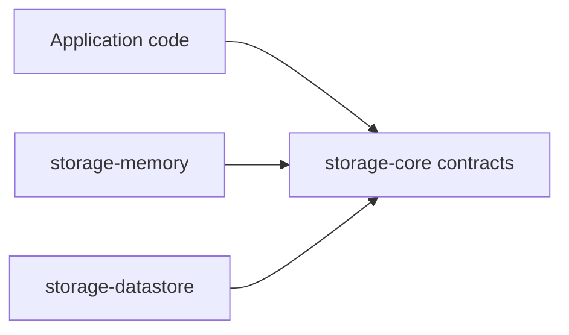

# Core Concepts

## Focused Modules

Each artifact owns one concern. Consumers install only the modules they use.

## Storage Contracts and Providers

Storage providers implement the contracts from `storage-core`, so production
and test providers can be exchanged without changing callers.

## Reactive Key Values

A `KeyValue<T>` exposes a `Flow<T>`, suspending reads, writes, property
delegation, and Compose state integration. Providers decide where values live;
callers depend on the same contract.

## Restorable State

`state-handle` wraps AndroidX `SavedStateHandle` with typed delegates. It is for
small UI state that must survive recreation, not for durable application data.

## Request Orchestration

Splinter separates the operation strategy from execution policy and lifecycle
rules. Strategies describe what runs; policies describe how overlapping
executions behave.

## Platform Availability

Common source sets expose APIs across supported targets. A module may still have
runtime restrictions when an upstream dependency has no implementation for a
target. These restrictions are documented on each module page.

## One Release Train

All artifacts use the same Arch Toolkit version. This keeps inter-module
dependencies predictable.
