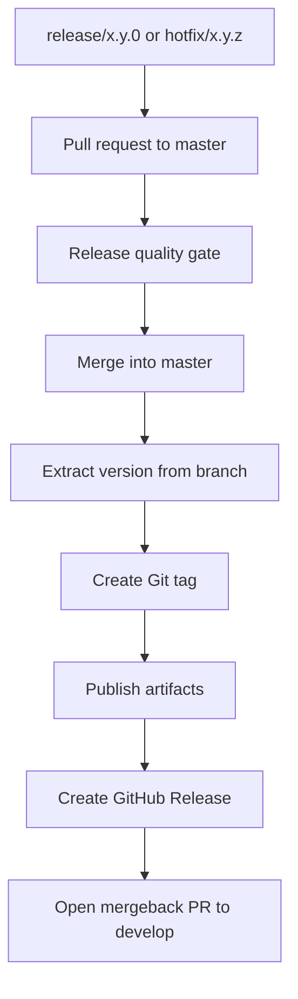

# Ecosystem Gitflow

Arch libraries are independent, but they follow one release contract. Normal work flows through
`develop`; anything that reaches `master` is a publication event.

```text
feature/* --+
config/*  --+--> develop ---> release/x.y.0[-rcN] --+
bugfix/*  --+                                       |
                                                  +--> master --> tag --> publish
hotfix/x.y.z[-rcN] -------------------------------+
```

## Branch Roles

| Branch | Responsibility |
|:-------|:---------------|
| `develop` | Receives normal development and keeps the next release candidate alive. |
| `master` | Represents published history. A merge into `master` creates a tag and publishes. |

`master` is not a parking lot. It only receives release and hotfix branches.

## Allowed Branches

```text
To develop:

feature/my-new-api
config/update-ci
bugfix/fix-empty-state

To master:

release/2.0.0
release/2.0.0-rc1
hotfix/2.0.1
hotfix/2.0.1-rc1
```

| Target | Accepted branch patterns | Meaning |
|:-------|:-------------------------|:--------|
| `develop` | `feature/*` | Product or API work. |
| `develop` | `config/*` | Build, CI, tooling, docs infrastructure, or repository configuration. |
| `develop` | `bugfix/*` | Fixes that are not emergency production patches. |
| `master` | `release/x.y.0` | Stable major or minor release. |
| `master` | `release/x.y.0-rcN` | Release candidate for a major or minor release. |
| `master` | `hotfix/x.y.z` | Patch release, where `z >= 1`. |
| `master` | `hotfix/x.y.z-rcN` | Release candidate for a patch release. |

## Release vs Hotfix

Use a release branch when the version ends in patch `0`.

```text
release/1.4.0
release/2.0.0-rc1
```

Use a hotfix branch when the patch is `1` or higher.

```text
hotfix/1.4.1
hotfix/1.4.2-rc1
```

This keeps version intent visible before CI runs.

## Pull Request Gates

### Into develop

PRs into `develop` must pass the everyday quality gate:

```text
lint -> build -> tests -> docs when affected
```

Docs are affected when the PR changes:

- public API;
- user-visible behavior;
- setup or installation;
- CI or release flow;
- samples.

### Into master

PRs into `master` must pass the release gate:

```text
lint -> build -> tests -> coverage -> docs review -> affected samples
```

For `arch-toolkit`, the web sample is part of the release product. A tag publication must build:

```text
MkDocs + Dokka + web sample -> GitHub Pages
```

If the web sample does not build, the `arch-toolkit` release fails.

## CI Enforcement

Gitflow is enforced by GitHub Actions, not by convention alone.

```text
Pull request
     |
     v
Branch Policy
     |
     +-- develop accepts feature/*, config/*, bugfix/*
     |
     +-- master accepts release/x.y.0[-rcN], hotfix/x.y.z[-rcN]
```

On `master`, a merged release or hotfix PR is the release trigger:

```text
merge release/hotfix PR
        |
        v
resolve version from branch
        |
        v
create tag
        |
        v
publish artifacts
        |
        v
create GitHub Release
```

The detailed CI and artifact flow lives in [CI and Release](ci-release.md).

## Master Merge Flow



The branch name is the version source. CI should not ask for a second version input.

## Mergeback

Every publication creates a mergeback PR into `develop`.

```text
master tag 2.0.0
        |
        +-- generated changelog
        +-- release notes metadata
        +-- mergeback PR -> develop
```

The mergeback is mandatory before the next release or hotfix. If it conflicts, fix the conflict in
the mergeback PR. Do not patch published history on `master`.

## GitHub Release Content

A good GitHub Release should be useful without opening the repository:

- short executive summary;
- highlights;
- breaking changes;
- migration notes when needed;
- artifact list;
- compatibility notes;
- links to docs, API reference, and samples;
- contributors;
- compare link;
- executed checks;
- known issues when any exist.

## Repository Rhythm

Each repository releases independently. There is no global ecosystem version.

`arch-toolkit` is the ecosystem hub:

- central standards live here;
- the official sample experience lives here;
- library docs link back here for ecosystem context and samples;
- new or unclear libraries can incubate here before extraction.

Extraction happens when a library has:

- stable API;
- clear purpose;
- isolated usage that makes sense outside `arch-toolkit`.
