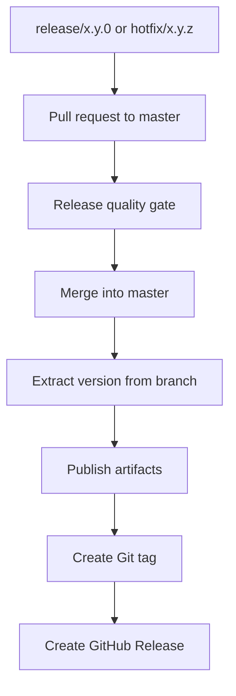

# Ecosystem Branching

Arch libraries are independent, but they follow one release contract. Normal work flows through
`master`; release and hotfix merges into `master` are publication events.

```text
feature/* ----+
fix/* --------+
bugfix/* -----+
config/* -----+--> master
docs/* -------+
chore/* ------+
dependabot/* -+

release/x.y.0[-rcN] --+
hotfix/x.y.z[-rcN] --+--> master --> tag --> publish
```

## Branch Roles

| Branch | Responsibility |
|:-------|:---------------|
| `master` | Main development line and published history. Release and hotfix merges create a tag and publish. |
| `release/*` | Temporary branch for a major or minor release, where the patch version is `0`. |
| `hotfix/*` | Temporary branch for a patch release, where the patch version is `1` or higher. |

There is no long-lived `develop` branch in the release contract. This avoids drift between
integration and published history.

## Allowed Branches

```text
To master:

feature/my-new-api
fix/fix-empty-state
bugfix/fix-empty-state
config/recover-release-ci
docs/update-release-guide
chore/update-tooling
dependabot/gradle/gradle-wrapper-9.6.1
release/2.0.0
release/2.0.0-rc1
hotfix/2.0.1
hotfix/2.0.1-rc1
```

| Target | Accepted branch patterns | Meaning |
|:-------|:-------------------------|:--------|
| `master` | `feature/*` | Product or API work. |
| `master` | `fix/*`, `bugfix/*` | Normal bug fixes. |
| `master` | `config/*` | Build, CI, tooling, docs infrastructure, or repository configuration. |
| `master` | `docs/*` | Documentation-only changes. |
| `master` | `chore/*` | Maintenance that does not change runtime behavior. |
| `master` | `dependabot/*` | Automated dependency updates. |
| `master` | `release/x.y.0` | Stable major or minor release. |
| `master` | `release/x.y.0-rcN` | Release candidate for a major or minor release. |
| `master` | `hotfix/x.y.z` | Patch release, where `z >= 1`. |
| `master` | `hotfix/x.y.z-rcN` | Release candidate for a patch release. |

## Release vs Hotfix

Use a release branch when the version ends in patch `0`.

```text
release/1.4.0
release/2.0.0-rc1
```

Use a hotfix branch when the patch is `1` or higher.

```text
hotfix/1.4.1
hotfix/1.4.2-rc1
```

This keeps version intent visible before CI runs.

## Pull Request Gates

Every PR into `master` must pass the standard quality gate:

```text
lint -> build -> tests -> coverage -> docs review -> affected samples
```

Docs are affected when the PR changes:

- public API;
- user-visible behavior;
- setup or installation;
- CI or release flow;
- samples.

For `arch-toolkit`, the web sample is part of the release product. A tag publication must build:

```text
MkDocs + Dokka + web sample -> GitHub Pages
```

If the web sample does not build, the `arch-toolkit` release fails.

## CI Enforcement

Branching is enforced by GitHub Actions, not by convention alone.

```text
Pull request
     |
     v
Branch Policy
     |
     +-- master accepts feature/*, fix/*, bugfix/*, config/*, docs/*,
         chore/*, dependabot/*, release/x.y.0[-rcN], or hotfix/x.y.z[-rcN]
```

On `master`, a merged release or hotfix PR is the release trigger:

```text
merge release/hotfix PR
        |
        v
resolve version from branch
        |
        v
publish artifacts
        |
        v
create tag
        |
        v
create GitHub Release
```

The detailed CI and artifact flow lives in [CI and Release](ci-release.md).

## Master Merge Flow



The branch name is the version source. CI should not ask for a second version input.

## GitHub Release Content

A good GitHub Release should be useful without opening the repository:

- short executive summary;
- highlights;
- breaking changes;
- migration notes when needed;
- artifact list;
- compatibility notes;
- links to docs, API reference, and samples;
- contributors;
- compare link;
- executed checks;
- known issues when any exist.

## Repository Rhythm

Each repository releases independently. There is no global ecosystem version.

`arch-toolkit` is the ecosystem hub:

- central standards live here;
- the official sample experience lives here;
- library docs link back here for ecosystem context and samples;
- new or unclear libraries can incubate here before extraction.

Extraction happens when a library has:

- stable API;
- clear purpose;
- isolated usage that makes sense outside `arch-toolkit`.
