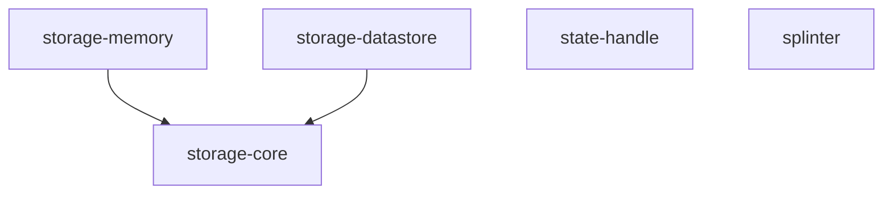

# Modules

Arch Toolkit publishes five independent artifacts on one release train.

| Module | Main use | Persistent |
|:-------|:---------|:----------:|
| [storage-core](storage-core.md) | Storage contracts, typed keys, delegates, and Flow support | Backend-defined |
| [storage-memory](storage-memory.md) | Tests, previews, and temporary state | No |
| [storage-datastore](storage-datastore.md) | Preferences on Android, JVM, and Apple | Yes |
| [state-handle](state-handle.md) | Small restorable UI and ViewModel state | Recreation only |
| [splinter](splinter.md) | Request execution, polling, cache, and flow mirroring | No |

Use the [module selection guide](../using/choosing-modules.md) when more than one
module appears to fit.
