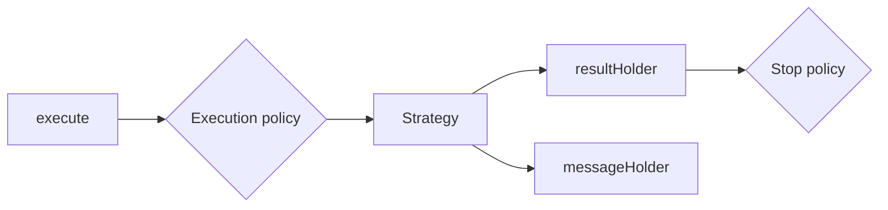

# Splinter

Artifact: `io.github.matheus-corregiari:splinter`

## Purpose

Splinter orchestrates asynchronous work and exposes observable result and log
streams. Strategies describe the work; execution and stop policies control its
lifetime.

## Use It When

- A request needs loading, success, and error state.
- Repeated calls need queue, cancellation, or ignore behavior.
- Work requires polling, cache decisions, or mirroring another Flow.

Do not use it as a replacement for simple coroutine calls that need no shared
state or execution policy.

## Installation

```kotlin
commonMain.dependencies {
    implementation("io.github.matheus-corregiari:splinter:<latest-version>")
}
```

## Targets

Android, JVM, iOS arm64, iOS simulator arm64, JS, and WasmJS.

## Concepts and Behavior

Strategies:

- `OneShot` runs one request and can apply cache, fallback, mapping, and timing.
- `Polling` repeats work under interval and error limits.
- `MirrorFlow` maps an existing Flow into Splinter result state.

Execution policies are `ParallelQueue`, `SequentialQueue`,
`IgnoreWhenHasRunningOperations`, and `CancelWhenHasRunningBeforeStart`.
Stop policies are `UntilRequest`, `AfterFirstExecution`, and `OnLifecycle`.



## Example

```kotlin
val profileRequest = splinter(
    id = "profile",
    strategy = Strategy.oneShot {
        request { repository.loadProfile() }
    },
    config = {
        policy(Splinter.ExecutionPolicy.CancelWhenHasRunningBeforeStart)
        stop(Splinter.StopPolicy.UntilRequest)
    }
)

profileRequest.execute()
val result = profileRequest.await()
```

## Architecture

Each execution creates an internal apprentice that runs the strategy. The
Splinter instance aggregates result and message flows and applies overlap,
cancellation, and lifecycle rules.

## Known Limitations

- Result and message holders retain bounded replay history.
- Lifecycle behavior depends on an owner supplied in configuration.
- Release-candidate APIs may still change before stable `2.0.0`.

## Troubleshooting

If a second execution is ignored, inspect the execution policy. If work
continues after a screen closes, provide a lifecycle owner or explicitly call
`cancel()` or `kill()`.

[Open the Splinter API reference](../api/splinter/html/index.html).
