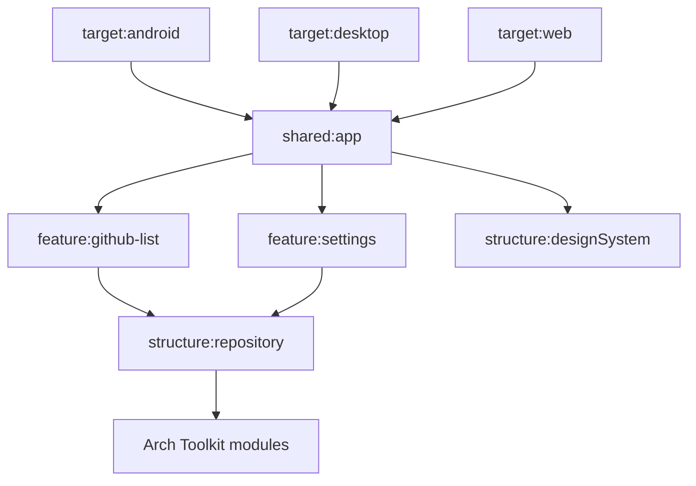

# Sample Architecture

## Modules

| Area | Gradle modules |
|:-----|:---------------|
| Targets | `sample:target:android`, `desktop`, `web` |
| Application shell | `sample:shared:app` |
| Features | `github-list`, `settings` |
| Shared structure | `core`, `designSystem`, `repository` |

## Storage Binding

Android, JVM, and Apple source sets bind `DataStoreProvider`. JS and WasmJS bind
`MemoryStoreProvider` because `storage-datastore` has no operational web
backend.

## Relationship to Published Modules

The sample consumes local project modules while developing the repository. It
therefore validates source compatibility before the artifacts are published,
but it also contains third-party libraries that can fail independently from
Arch Toolkit.
