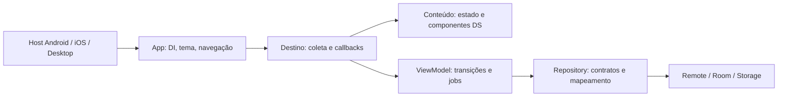

# Plano de refactor geral do Showcase

Estudo em `ad6d408`, 02/10/2026. Escopo: app e sua infraestrutura compartilhada.
Bibliotecas publicadas e build conventions são fronteiras de compatibilidade;
não foram reescritas como efeito colateral. O plano funcional foi implementado;
profiling de dispositivos permanece pendente. [Estudo visual](showcase-visual-study.md).

## Implementação e evidências

O refactor funcional e visual está aplicado. A tabela abaixo registra o resultado;
as seções seguintes preservam a análise e a sequência originalmente propostas.

| Área | Implementação |
| --- | --- |
| Bootstrap / dados | Coil configurado no bootstrap Koin; PageRO, RepoRO e UserRO como data classes; paginação montada com val/copy |
| UI / DS | Tokens semânticos, seis paletas, 1120/760 dp, gutters adaptáveis, alinhamento horizontal e início no topo |
| Configurações | Conteúdo puro com valores/callbacks; painel contínuo; testes de tema, contraste e idioma |
| GitHub | Debounce 300 ms; draft separado da busca ativa; submit/filtro imediato; cancelamento e generation preservados; composables diretos com keys |
| Restauração | Snapshot v4 sem loading/error; fallback v3; snapshot corrompido tratado; rascunho salvo separadamente |
| Toolkit / Design | Controles → resultado → código expansível; catálogo nomeado; snippets da fonte executável; campos preservados no resize |
| Packages | DS, core, repository e data com nomes neutros; GitHub isolado na feature; módulos Gradle e APIs publicadas preservados |

Os nove testes de ListViewModel incluem tempo virtual, resposta atrasada após
editar o draft, submit imediato, retry, snapshot antigo/corrompido e payload grande.
O teste reproduzível registra o JSON abaixo e confirma **zero escritas transitórias**
ao iniciar loading e ao falhar uma paginação com a mesma lista. O código anterior
serializava novamente nessas transições. Isso comprova trabalho evitado, não ganho
de FPS nem latência no dispositivo.

| Itens da fixture | Bytes de JSON | Escritas durante loading/erro |
| ---: | ---: | ---: |
| 20 | 5544 | 0 |
| 200 | 55604 | 0 |
| 1000 | 278804 | 0 |

86 referências Android incluem fonte expandida, seis paletas, landscape/tablet,
EN/PT e fonte até 2x. Testes JVM cobrem keyboard submit, preferências/disclosure,
resize, CRUD/log, navegação e alinhamento. Os gates locais incluem build Android/R8,
tests, coverage, lint, docs e manifest das sete coordenadas RC19.

Limitações: não há dispositivo Android conectado para Perfetto/frame timing nem
Mac local para executar host/simulador iOS. CI macOS continua responsável pelo
host Apple; inspeção manual de acessibilidade e comparação de frame timing nos
hosts continuam pendentes. Não se afirma o orçamento de 5% como medido.


## Padrões anteriores que continuam

`docs/wiki/contribution-guide.md`, `docs/showcase.md`, features atuais e Splinter
mostram a base: KMP primeiro, módulos com responsabilidade, construtores explícitos,
Flow, políticas de execução/cancelamento, rotas tipadas, factories expect/actual
restritas à plataforma e testes de comportamento. Preservar esse vocabulário.
Não copiar mecanismos internos de uma biblioteca de execução para uma tela simples.

Fluxo de leitura do app:



Features não conhecem outras features ou fontes. DI no destino/composição; conteúdo
recebe valores e funções. `verifyShowcaseBoundaries` permanece gate.

## Evidências e decisões

Os caminhos abaixo são relativos aos diretórios Kotlin dos módulos indicados.
Custos potenciais não são regressões medidas. A inspeção foi dirigida, não uma
auditoria linha a linha de todas as bibliotecas.

| Prioridade | Evidência atual | Proposta | Critério de conclusão |
| --- | --- | --- | --- |
| P1 | `app/.../ShowcaseApp.kt`: registra `setSingletonImageLoaderFactory` no corpo composable | Configuração única no bootstrap/factory apropriada ao host; client injetado e dono explícito | Uma configuração por bootstrap; tema/idioma não reinstalam a factory; imagens continuam nos três hosts |
| P1 | `design/widget/.../AppLayout.kt`: mínimo da grade participa da largura global | ContentFrame com política por papel; grade decide suas colunas pelas próprias constraints | Testes de medidas e fonte; detalhes/Settings não alargam para acomodar grade |
| P1 | `github-sample/.../ListViewModel.kt`: SearchControls chama search a cada edição | Separar query digitada e pesquisa efetiva; debounce inicial proposto de 300 ms; submit/filtro imediatos | Tempo virtual: digitação rápida gera uma busca; última intenção vence; paginação não usa query antiga |
| P1 | `ListViewModel.update`: serializa lista completa até ao iniciar loading | Separar snapshot restaurável de flags transitórias; persistir somente alterações restauráveis; medir tamanho antes de limitar | Preservar restauração atual; loading não reserializa a mesma lista; registrar bytes/tempo com 20/200/1000 itens |
| P1 | `repository/.../PageRO.kt`: nextPage é var; RemoteGithubRepository usa apply para preenchê-lo | Resultado completo e imutável no mapeamento/factory, com val | Mesmos limites e páginas; DTO continua fora da UI; teste de mapping |
| P2 | `github-sample/.../ui/list/state/_state.kt` e ManyListState unem objeto e Draw; _screen instancia classe para desenhar lista | Composables diretos RepositoryList/RepositoryRow; estado contém dados, não renderização | Mesmas keys por id, seleção, scroll e paginação; eliminar classes de estados que não são usadas |
| P2 | `RepoVO` replica RepoRO com uma transformação de linguagem null→vazia | Decidir após estabilizar view: usar RO quando suficiente, ou modelo UI apenas com transformação real | Sem segunda cópia integral sem motivo; sem mover localização para repository |
| P2 | `AppHomeContent` monta descritores fixos de destinos em composição | Lista fixa privada/imutável fora da função, tradução no ponto de render | Mesmo destaque em subrotas, navegação e EN/PT; sem introduzir registro genérico |
| P2 | `settings/.../SettingsContent`: recebe MutableState para preferências | Receber valores + callbacks no conteúdo; destino coleta e escreve | Testes puros sem repository; tema/idioma persistem e recomposição respeita estado |
| P2 | `ToolkitScreen`: fonte/logs e controles no mesmo painel; labels de catálogo são extraídos de String/Triple | Componentes pequenos e modelo nomeado para item de catálogo; fonte em disclosure | Clear/CRUD continuam reais; snippets gerados não divergem; campos sobrevivem a resize |
| P2 | `_screen.kt` DS usa WindowWidthSizeClass obsoleto e remember de cálculos triviais | Migrar à API compatível do WindowSizeClass e reduzir estado derivado desnecessário | Mesma navegação, resize/fonte/cutout; compile em todos os targets suportados |
| P3 | Packages do DS/repository ainda incluem github.shared apesar de quatro features | Migração mecânica e isolada para nomes neutros quando etapas funcionais estabilizarem | Imports/KSP/routes/tests verificados; nenhuma alteração de API publicada |

O cancelamento com Job + generation já rejeita respostas atrasadas e tem teste.
Manter essa garantia ao adicionar debounce. Não trocar tudo por flatMapLatest
somente por estilo: cancelamento sozinho não garante rejeição de fontes não cooperativas.
Não afirmar que configuração da factory já cria um ImageLoader por recomposição:
o fato observado é o registro no corpo composable; medir instâncias separadamente.

## Kotlin simples e idiomático

| Feature | Onde ajuda | Limite |
| --- | --- | --- |
| `data class` + val + copy | State/snapshot/PageRO com comparação e atualização claras | List é read-only, não necessariamente imutável; não compartilhar lista mutável |
| `sealed interface` + `data object` + when exaustivo | Resultado inicial e status de operação exclusivos | Paginação é eixo separado; não substituir flags por hierarquia gigantesca |
| null safety e smart casts | Conteúdo opcional/failure; evitar !! | Nullable que representa ausência legítima deve continuar nullable |
| `StateFlow` privado mutável + asStateFlow | Estado observável existente | update para concorrência real; não tornar todo campo Flow |
| funções suspend + structured concurrency | I/O e cancelamento ligado ao ViewModel | Não engolir CancellationException em catch ou runCatching |
| extension functions pequenas | Mapping e formatação puros já existentes | Nome deve explicar transformação; evitar encadear scope functions |
| enum/data object | Opções fechadas e rotas sem payload | Não usar strings mágicas para estado; não criar event bus global |
| visibility internal/private | Detalhes de feature e helpers | Mudança de API pública exige análise binária separada |

Exemplo ilustrativo de status, a adaptar ao domínio real:

```kotlin
sealed interface LoadStatus {
    data object Idle : LoadStatus
    data object Loading : LoadStatus
    data class Failed(val reason: GithubFailure) : LoadStatus
}

data class SearchUiState(
    val query: String,
    val items: List<RepoRO> = emptyList(),
    val initialLoad: LoadStatus = LoadStatus.Idle,
    val nextPageLoad: LoadStatus = LoadStatus.Idle,
    val nextPage: Int? = null,
)
```

Não serializar cegamente o exemplo: definir snapshot separado com query/filtro,
itens ou estratégia de recuperação, nextPage e versão. Testar fallback de snapshots
anteriores. `when` exaustivo na apresentação; transitions pequenas no ViewModel.

Sem framework de reducer/base ViewModel, camada use-case de uma linha, DSL própria,
context receivers ou recursos experimentais só para encurtar código. `inline`,
`value class`, Sequence e coleções persistentes só entram com motivo concreto;
novas dependências precisam justificar seu custo. Nome legível supera expressão curta.

## Desempenho: medir antes, comparar depois

Não foi executado benchmark de frames nesta etapa; as medidas de snapshot e
requests estão registradas acima. Usar build release/R8, mesmo dispositivo,
mesma massa de dados, aquecimento e múltiplas rodadas; guardar mediana e p95,
trace e configuração. Debug e contagem de recomposições isolada não provam ganho.

| Cenário | Baseline a coletar | Mudança candidata |
| --- | --- | --- |
| Digitar 10 caracteres rapidamente e trocar filtro | Requests iniciadas/canceladas, latência até último resultado | Debounce e snapshot de query efetiva |
| Paginar 20→200→1000 registros | Tempo/bytes de serialização, alocações, p95 de frame durante loading | Persistência sem flags transitórias; dedup apenas se trace justificar |
| Rolar 200 resultados com avatares | Frame timing, memória/cache, recomposição por row | Keys já presentes; contentType somente se houver tipos diferentes; image loader único |
| Abrir Toolkit e gerar 100 logs | Tempo de composição/join, memória, scroll com fonte 2× | remember(logs) se custo aparecer; manter buffer de 100 sem ring buffer prematuro |
| Mudar tema/idioma e redimensionar | Instâncias de loader, estado dos campos, tempo de layout | Bootstrap e política de constraints |

Usar Perfetto/Layout Inspector e benchmark Android para frame/startup; profiling
equivalente no Desktop e Instruments no iOS. Começar por baseline Android, mas
um ganho lá não garante ganho multiplataforma. Orçamento inicial: nenhuma regressão
repetível > 5% em mediana/p95; investigar variação com ruído e repetir antes de concluir.
Só chamar melhoria de performance quando houver comparação reproduzível.

Compose: preservar lazy keys existentes; state hoisting com escopo mínimo; cálculos
relevantes fora da composição ou remember com dependências completas; derivedStateOf
apenas se mudança frequente produz resultado menos frequente. Não aplicar @Stable/
@Immutable sem cumprir o contrato, nem mudar stability config para mascarar mutação.
Coleta sensível a lifecycle deve ser verificada nos targets atuais, mantendo
destino que coleta e conteúdo puro; não importar solução Android-only em commonMain.

## Migração em commits pequenos

| Etapa | Entrega | Dependência | Validação e rollback |
| --- | --- | --- | --- |
| 0 | Baselines: visual atual, traces, requests e snapshot sizes | Nenhuma | Relatório reproduzível; sem mudar runtime |
| 1 | Bootstrap de imagens e PageRO imutável | 0 | Repository/common tests e smoke nos hosts; commits separados, revert independentes |
| 2 | Tokens semânticos e ContentFrame/PageHeader com novo estudo | 0 | Previews/contraste/layout/fonte; manter aliases temporários dos tokens antigos |
| 3 | Piloto Configurações + navegação | 2 | Persistência, EN/PT, seleção, foco e seis paletas; aprovar refs antes de migrar outras telas |
| 4 | GitHub: snapshot, debounce, status e composables diretos | 1, 2, 3 | Primeiro refactor com visual atual, depois redesign; cancelamento/retry/restore, keyboard e deeplink |
| 5 | Toolkit e Design: hierarchy, código expansível e catálogo nomeado | 2, 3 | CRUD/log/snippets, resize, foco/scroll e fonte 2× |
| 6 | Nomes neutros, helpers duplicados e limpeza de código sem uso | 4, 5 | Referências/KSP, imports, APIs, ciLint e docs; não misturar com mudanças funcionais |
| 7 | Comparação final, docs e gates em todos os hosts | Todas | Registrar métricas antes/depois, visual e exceções; manter PR aberta para revisão |

Prioridade alta não significa um commit grande. Em cada etapa: extrair caso de
teste do comportamento existente → refactor → confirmar equivalência → mudar
comportamento solicitado → atualizar documentação. Não manter duas árvores de
UI em produção nem criar feature flag permanente para esta migração.

## Testes e definição de pronto

Preservar testes atuais de resposta atrasada, retry da mesma página, restauração,
Room, log/Storage, navegação e resize. Acrescentar testes de debounce com relógio
virtual, snapshot antigo/corrompido, flags não persistidas, identidade de loader
no bootstrap e nova hierarquia/foco onde o comportamento mudar.

Gate por mudança: testes do módulo afetado + lint; UI também previews e screenshots
alterados revisados. No final:

```shell
./gradlew ciBuild ciTest ciCoverage ciLint ciDocs ciPublicationManifest -PincludeSamples -PreleaseVersion=2.0.0-rc19
./gradlew :sample:target:android:validateDebugScreenshotTest -PincludeSamples
python -m mkdocs build --strict
```

CI Ubuntu/macOS/Windows; iOS host/framework/simulator em macOS e inspeção humana
de acessibilidade Android/iOS/Desktop. Comparar manifest das sete coordenadas
Splinter; nenhum novo artefato publicado pelo refactor do app. Manter thresholds
visuais, lint real e minSdk; não introduzir baseline de erros.

As 85 referências eram o baseline do estudo, não obrigação de manter o mesmo número:
novos estados/layouts podem exigir novos casos. Encerrar com métricas, cenários
validados e limitações explícitas. A implementação e seus limites estão registrados no início deste documento.

## Referências

- [Contribuição do projeto](wiki/contribution-guide.md) e [arquitetura atual](showcase.md#architecture).
- [Kotlin conventions](https://kotlinlang.org/docs/coding-conventions.html),
  [sealed types](https://kotlinlang.org/docs/sealed-classes.html) e
  [cancelamento](https://kotlinlang.org/docs/cancellation-and-timeouts.html).
- [Compose performance](https://developer.android.com/develop/ui/compose/performance/bestpractices)
  e [contratos de estabilidade](https://developer.android.com/develop/ui/compose/performance/stability/fix).
