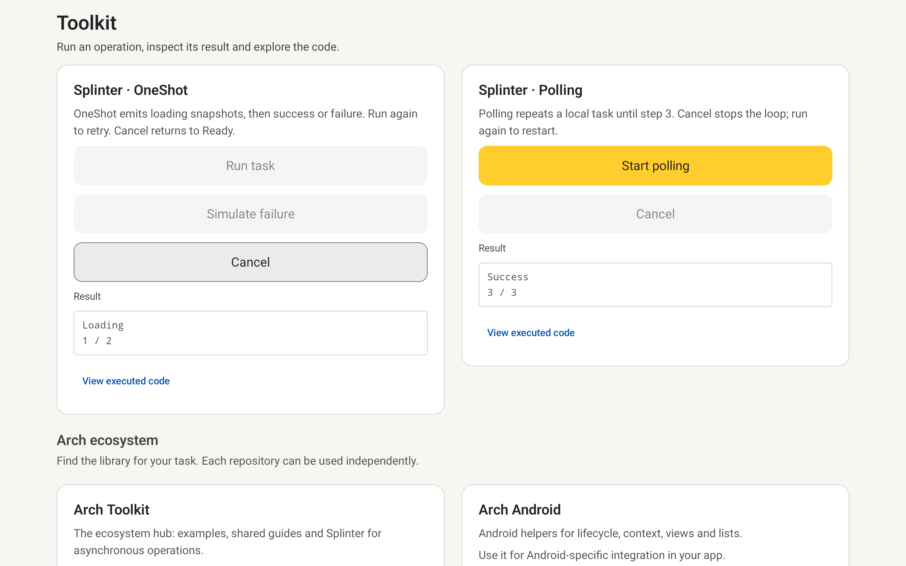
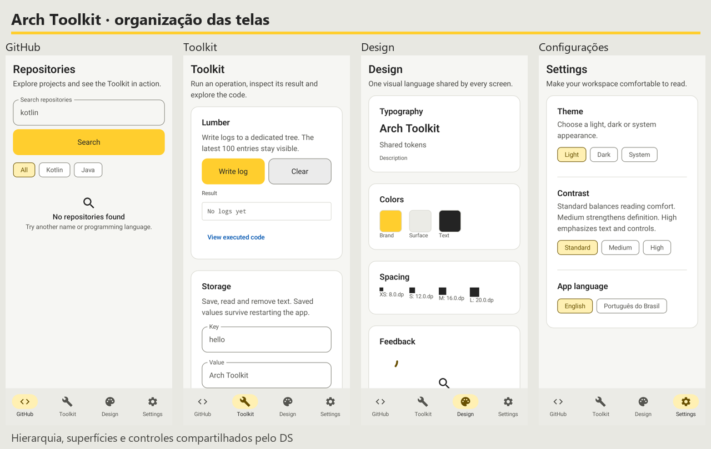
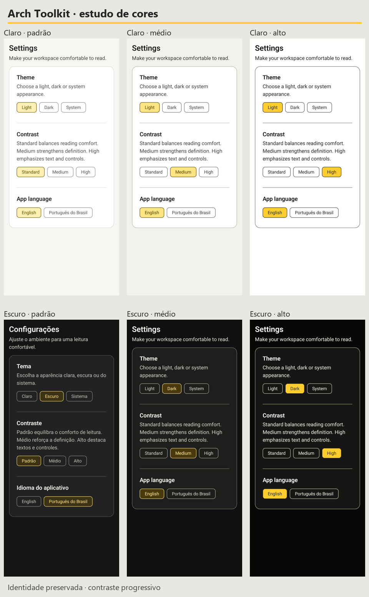
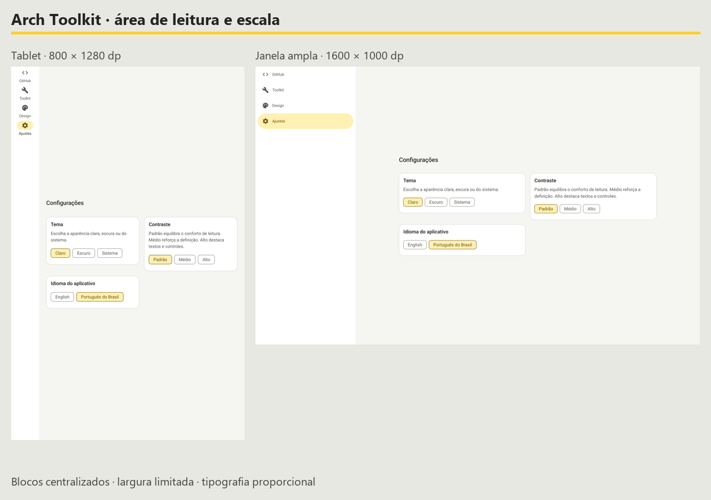
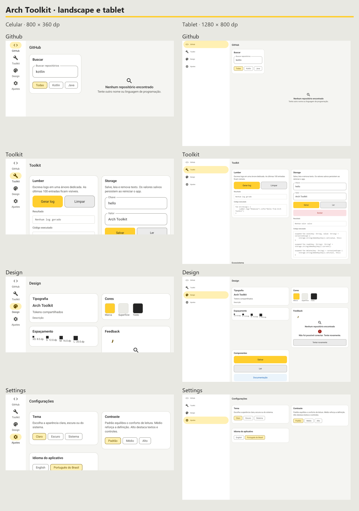
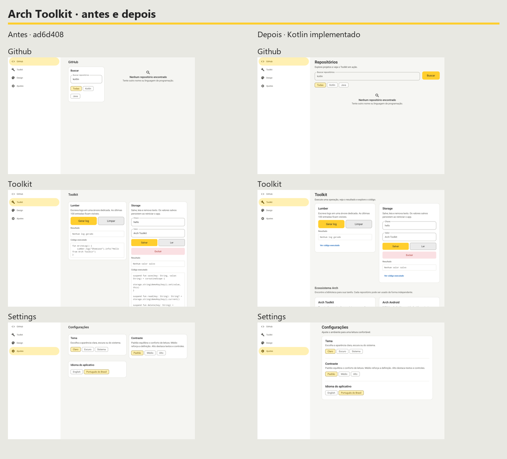
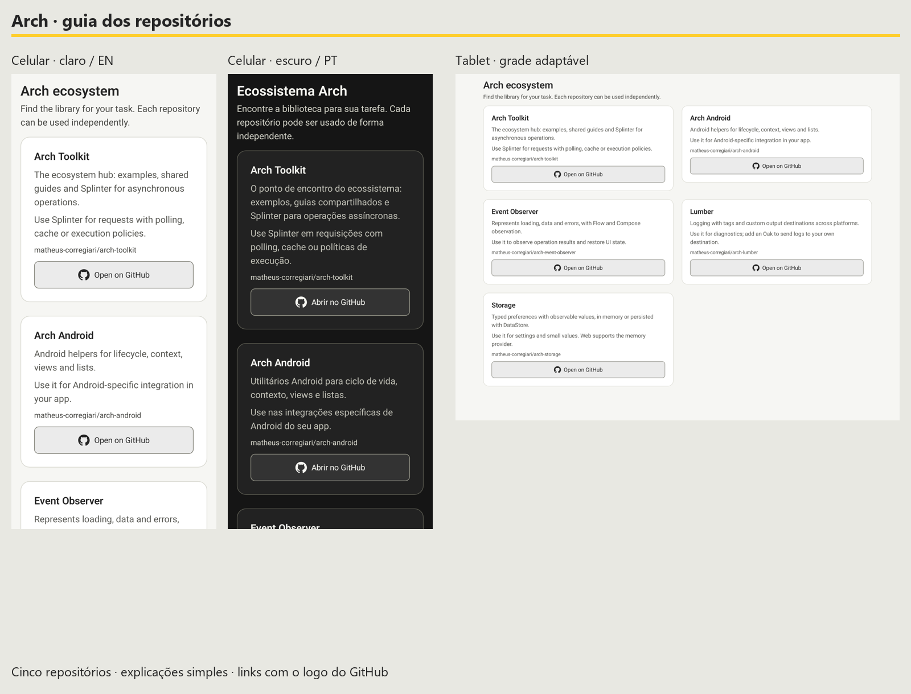

# Arch Toolkit Showcase

An executable reference application for Android, iOS and Desktop, with shared
features in `commonMain`. Web is pending by explicit project decision: Easy
Navigation 1.1.0 has no JS/Wasm artifact. No alternative web navigator is provided.

Easy Navigation 1.1.0 uses Lumber's pre-1.2 binary signature. Sample configurations
select Lumber 1.1.0 and Storage 2.0.0-rc16 for compatibility; Storage stable 1.0.1
requires the incompatible Lumber 1.4 ABI. The published Toolkit library keeps its own
existing dependency version. Remove the sample pin only after Android, JVM and iOS
navigation tests pass with an upstream-compatible release.

## Run



Use JDK 21 and the configured Android SDK. Sample projects require `-PincludeSamples`.

```shell
./gradlew :sample:target:desktop:run -PincludeSamples
./gradlew :sample:target:android:installDebug -PincludeSamples
```

On an Apple Silicon Mac, install Xcode and XcodeGen, then:

```shell
xcodegen generate --spec sample/target/ios/project.yml
open sample/target/ios/Showcase.xcodeproj
```

Choose the Showcase scheme and a simulator. Its build phase compiles the shared
framework. Physical devices require your signing team and code signing enabled
locally. CI builds the unsigned simulator host and runs KMP tests on macOS; this
is not manual simulator or accessibility inspection.

## Explore

- **GitHub:** search, language filters, pagination and retry, repository details,
  and the last 20 opened repository identities persisted in Room. New searches
  cancel previous requests and reject late results. Page failures retain rows.
  History is local, with no synchronization or offline GitHub mirror.
- **Toolkit:** Lumber writes with a dedicated tree and a clearable 100-entry buffer;
  Storage create/read/update/delete with persistence across restarts. Snippets are
  generated from marked regions of the actual `ToolkitDemoRepository.kt` source.
  Splinter adds local OneShot snapshots with success/failure/retry and a three-step
  polling task. Both can be cancelled and repeated. Their snippets come from the
  executed `SplinterDemo.kt`; tests use virtual time. The feature compiles the exact
  Splinter library sources and regression tests against the existing sample Lumber
  compatibility pin. Published library dependencies remain unchanged.
  The Arch ecosystem catalogue explains Arch Toolkit/Splinter, Arch Android,
  Event Observer, Lumber and Storage in plain English/Portuguese, with use cases
  and a GitHub-mark button opening the corresponding repository. Cards use the
  existing width/font-aware grid. GitHub marks are local vectors, so links do not
  depend on downloading icons.
- **Design:** the app's real theme tokens, typography, spacing, buttons, empty and
  error widgets. Change theme and contrast in Settings to inspect all states.
- **Settings:** persistent English/Portuguese (Brazil), theme and contrast. Changes
  apply at runtime. `AppText` centralizes both translations; unknown language tags
  fall back to English. Dates/counts follow the selected language. GitHub data and
  code are never translated.

## Navigation and links

Feature-owned serializable routes use Easy Navigation `@Route`, `@Scope`,
`@Deeplink` and `@ParentRoute`. The app aggregates generated registries in one
Navigation3 controller. Details require only owner/name and load independently.

```shell
adb shell am start -a android.intent.action.VIEW -d "archtoolkit://github/matheus-corregiari/arch-toolkit"
./gradlew :sample:target:desktop:run -PincludeSamples --args="archtoolkit://github/matheus-corregiari/arch-toolkit"
xcrun simctl openurl booted "archtoolkit://github/matheus-corregiari/arch-toolkit"
```

Other paths: `/github`, `/toolkit`, `/design`, `/settings`. Android handles initial
and new intents; iOS forwards SwiftUI URL events; Desktop accepts a launch argument.
Foreign schemes and invalid links are ignored. Navigation3 saves the typed stack;
GitHub saves query, filters and rows without restoring loading flags. Back returns
to the previous destination. Top-level tabs start a new stack.

## Architecture

| Path under `sample/` | Responsibility |
| --- | --- |
| `target/{android,ios,desktop,web}` | Platform launchers; web pending |
| `shared/app` | Composition, Koin, shell and global links |
| `shared/features/{github-sample,toolkit-sample,design-sample,settings}` | Views, ViewModels, state and routes |
| `shared/data/repository` | Repository objects (`RO`), mapping and source coordination |
| `shared/data/source/remote` | Ktorfit interfaces and transport models |
| `shared/data/source/local` | Room entities/DAO and persistence factories |
| `shared/structure/http` | Clients, engines, JSON, timeouts and transport setup |
| `shared/structure/design/core` | Tokens, theme and translated UI text |
| `shared/structure/design/widget` | Reusable presentation widgets |
| `shared/structure/core` | Small shared models and formatting |

Features depend on repository contracts and design, never other features or sources.
Repository state does not expose transport/Room models. Dependencies enter classes
through constructors; Koin resolves them at composition boundaries. Cancellation
remains cancellation. HTTP uses platform TLS validation. `verifyShowcaseBoundaries`
checks forbidden project dependencies and cycles as part of `ciLint`.

## Add a feature or demo

1. Use an existing feature's Gradle setup under `shared/features`; define its state,
   constructor-injected ViewModel and tests in `commonMain`/`commonTest`.
2. Declare serializable routes with small identities and annotated destinations.
   Add the generated registry and ViewModel registration to `shared/app`.
3. Reuse design tokens/widgets and add both translations to `AppText`.
4. For demos, expose an actual operation, controls, visible result, reset and failure
   handling. Mark the executable source and extend `generateDemoSnippets`.
5. Prefer a documented catalogue card when no meaningful portable demo exists.
   Never add an Android-only dependency to `commonMain`.

Official ecosystem references: [Arch Android](https://github.com/matheus-corregiari/arch-android),
[Event Observer](https://github.com/matheus-corregiari/arch-event-observer),
[Lumber](https://github.com/matheus-corregiari/arch-lumber),
[Storage](https://github.com/matheus-corregiari/arch-storage),
[Easy Navigation](https://github.com/Pedro-Bachiega/easy-navigation/).

## Use as a base

Retain the launchers/composition, substitute your features and repositories, and
keep constructor injection and shared design/test seams. Change application IDs,
display names and persistence namespaces before shipping. This guide creates no
separate application.

## Check

```shell
./gradlew ciBuild ciTest ciCoverage ciLint ciDocs -PincludeSamples -PreleaseVersion=2.0.0-rc19
python -m mkdocs build --strict
```

Tests exercise cancellation/out-of-order responses, page retry, saved list state,
repository mappings/errors, Storage CRUD, language restoration, bounded logging,
formatting and generated links. Desktop navigation tests exercise back and saved
stack restoration. See `SHOWCASE_PLAN.md` for the current validation record.
Lazy list rows and bounded logs/history are implementation choices, not measured
performance claims.

## Android screenshot regression tests

Google's experimental Compose Preview Screenshot Testing plugin uses AndroidX
`@Preview` to render the actual shared feature content through Layoutlib, without
an emulator. AGP remains at 9.4. KMP features own their `src/screenshotTest` sources;
the Android target supplies the runner and reference storage. Screenshot-only
project dependencies are checked separately; production targets still depend on
`shared:app` only.

### Coverage matrix

The suite contains 101 references. Following Android's guidance, representative
configurations are sampled instead of multiplying every state by every device.

| Area | References | Visual contracts |
| --- | ---: | --- |
| GitHub list and detail | 29 | Loading, empty search, content/recent history, pagination loading/error/end, all four domain errors, missing metadata, long names/descriptions/topics, localized dates and counts |
| Settings | 10 | All six light/dark contrast palettes, system/language selections, narrow large text, wide layout |
| Toolkit | 18 | Lumber output, Storage empty/saved/read/deleted/invalid-key/error/busy states, ecosystem catalogue, expanded executable source, five-repository catalogue with GitHub marks, scrolled content |
| Design | 8 | Real tokens, button styles, disabled/loading/error/empty widgets, selected/unselected chips, scrolled content |
| App shell | 21 | All selected destinations, compact bottom bar, tablet rail, large-window drawer, phone/tablet landscape, tablet portrait, localized and large-text navigation |
| Shared widgets | 4 | Original English/light, Portuguese/dark, large font and wide high-contrast checks |

Representative feature content runs in light English, dark Portuguese, 320dp
narrow layouts with 1.5x and 2x fonts, and 840dp wide layouts. High contrast has
focused coverage in Settings, Design and GitHub. Shell breakpoints include 600dp
and short 800 × 360 landscape windows. All four destinations also run inside the
1280 × 800 tablet shell; Settings includes 800 × 1280 portrait and Toolkit includes
2x tablet text. A 1600 × 1000 shell checks the centered content limit.
This is not an exhaustive device matrix or an
accessibility certification.

Fixtures use API 35 and fixed dates, counts and text. Content composables receive
state and callbacks; production route adapters retain ViewModels and effects.
Tests do not start Koin, network or persistence. Repository avatars use an empty
URI; image downloading is outside this visual contract. Layoutlib captures loading
indicators at its fixed preview frame. These are Android rendering checks, not
iOS/Desktop pixel baselines.

### Running and reviewing

Use the same Windows/JDK 21 environment as the dedicated CI job:

```shell
./gradlew :sample:target:android:validateDebugScreenshotTest -PincludeSamples
```

For an intentional visual change, regenerate locally, inspect every changed PNG
and commit references alongside the UI change:

```shell
./gradlew :sample:target:android:updateDebugScreenshotTest -PincludeSamples
```

Feature tests: `sample/shared/features/*/src/screenshotTest/kotlin/`.
Shell tests: `sample/shared/app/src/screenshotTest/kotlin/`.
Shared setup/widget tests: `sample/target/android/src/screenshotTest/kotlin/`.
The host explicitly registers each feature's source directory and test dependency.

References: `sample/target/android/src/screenshotTestDebug/reference/`.
HTML report: `sample/target/android/build/reports/screenshotTest/preview/debug/index.html`.
CI uploads reports and actual/diff images as `showcase-screenshots`, including on
failure. CI validates only; it never updates references.

Add a state case for each visually distinct feature state, and a configuration
case for different wrapping, navigation or theme behavior. Keep fixtures fixed
and scroll to the section being tested. Generated references require visual review.
Interaction tests remain responsible for callbacks, navigation and transitions;
the existing JVM `ToolkitUiTest` capture is diagnostic only.

References: [Android screenshot testing guidance](https://developer.android.com/training/testing/ui-tests/screenshot),
[Compose Preview Screenshot Testing](https://developer.android.com/studio/preview/compose-screenshot-testing).

## Visual system and color study





The visual identity keeps brand yellow `#FFCE2E`, warm neutral surfaces, rounded
corners and the existing sans-serif typography. Yellow uses dark ink `#242424`
in both themes (10.44:1), rather than white text. Blue links and semantic red/green
remain reserved for links and feedback.

Each destination uses a top-aligned `AppPage` with horizontal centering and
adaptive fill width. GitHub/Toolkit/Design cap their workspace at 1120 dp;
Settings and details cap reading width at 760 dp. Gutters are 16/24/32 dp by
window size. Page headers expose a title and task description; short windows
omit the description to leave more room for controls and results. Sections use
24 dp padding. GitHub places search above results and keeps history expandable.
Toolkit orders controls, results and expandable executable source. Settings
uses one continuous preference panel with dividers.

`AppButton`, `AppTextField` and `AppChoiceGroup` are the shared controls. Choices
wrap with translations and font scaling; small buttons retain a 48 dp minimum
height. Compact windows with font scales above 1.3 use a labeled sections menu
instead of forcing four enlarged labels into a bottom bar. Selected controls and
navigation use the same yellow-derived surface and
foreground roles. Selection semantics, labels and heading semantics remain native.


### Responsive composition

Layouts use the space actually available after navigation and insets, following
[Android adaptive layout guidance](https://developer.android.com/develop/adaptive-apps/guides/support-different-display-sizes).
Column and pane counts react to available width and font scale, without device-name checks.

| Area | Compact or enlarged text | Landscape and tablet |
| --- | --- | --- |
| Toolkit and Design | One scrollable column | Two columns when each retains 360 dp scaled by font size, plus a 24 dp gap |
| Settings | One continuous scrollable preference panel | Same panel, centered horizontally with a 760 dp cap |
| GitHub search | Search above results; stacked field/action when text needs room | Field and Search action share a row when width permits; filters follow below; controls scroll within half the remaining height |
| Repository detail | One scrollable information card | Reading width capped at 760 dp |
| Navigation | Bottom bar in compact portrait, rail in landscape | Rail on medium/tablet widths; drawer from 1200 dp window width |

The section grid is limited to two columns, including very wide windows. Cards keep
their stable keys when the column count changes, preserving edited demo inputs.
The Toolkit ecosystem spans the grid. At 2x text the grid falls back to one column,
even on a tablet, so controls and snippets retain room to wrap.

JVM interaction tests resize a filled Storage form from two columns to one and back,
and exercise search/results at 800 × 360 with 2x text. The screenshot matrix covers
the navigation shell as well as populated GitHub landscape results.


#### Comfortable reading area

Pages fill available width within their role-specific cap, fill the available
height and remain top-aligned. Long content scrolls. Pagination belongs to the
lazy results list, so short results do not stretch the footer to the bottom.

Typography uses semantic roles and normal system font scaling:

| Text role | Compact | Medium / expanded |
| --- | ---: | ---: |
| Page heading | 24 / 30 sp | 28 / 34 sp |
| Section heading | 18 / 24 sp | 20 / 26 sp |
| Body | 16 / 24 sp | 16 / 24 sp |
| Metadata | 13 / 18 sp | 14 / 20 sp |
| Code | 13 / 22 sp monospace | 14 / 22 sp monospace |

JVM tests verify horizontal centering/top alignment, preserving edited forms
across resizing, keyboard search, and access to controls/results in short windows
with 2x text. A separate regression ensures the complete Search action is visible
in normal-font landscape.





Contrast changes text, control outlines and surface separation, rather than only
surface opacity. All base surfaces are opaque to keep their contrast independent
of the content underneath. Standard provides a calm hierarchy; medium deepens
body text and outlines; high makes control and surface edges explicit while
retaining the brand accent. Material color roles are mapped completely to the DS,
including container levels, fixed roles, outlines, error and inverse colors.

The exact palette values and canvas/card contrast ratios are recorded in the
[implemented visual study](showcase-visual-study.md#lightdark-e-tres-niveis-de-contraste).
Automated KMP tests additionally check normal text, links and semantic text against
canvas, card and inset surfaces (4.5:1), control outlines (3:1), medium/high body
text (7:1), brand ink, selected controls and Material roles. Decorative borders
and disabled controls have separate roles. These checks are not an accessibility
certification.



The [refactor record](showcase-refactor.md#implementacao-e-evidencias) covers the
300 ms debounce, separate draft/active query, transient-state-free snapshots,
bootstrap image loader, immutable page mapping and neutral Kotlin packages.

References: [WCAG text contrast](https://www.w3.org/WAI/WCAG22/Understanding/contrast-minimum.html)
and [non-text contrast](https://www.w3.org/WAI/WCAG22/Understanding/non-text-contrast.html).
The Android screenshot suite covers all six settings palettes, both languages,
compact/wide layouts, and font scales through 2.0. Review the rendered references
before accepting a deliberate visual change; do not relax comparison thresholds.




The repository link interaction test checks all five destination URLs. Four
dedicated previews cover English/light, Portuguese/dark, tablet and 2x fonts.
The GitHub mark comes from Primer Octicons; attribution is in the repository's
`THIRD_PARTY_NOTICES.md`.
